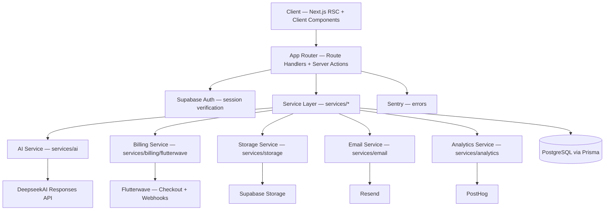
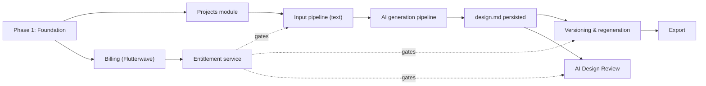

# Luma Implementation Plan

**Status:** Planning only — no code, schema, or packages were touched while producing this document.
**Prepared against:** `AGENTS.md`, all 10 files in `.agents/rules/`, all 4 skills in `.agents/skills/`, and `tokens/`.
**Repository state at time of writing:** greenfield — 15 files total, all of them rules/design-tokens, zero application code.

---

## How to read this document

- **Decision** — a call made to unblock planning, consistent with existing rules.
- **Assumption** — filling a real gap in the docs, labeled so it can be corrected.
- **Note** — context worth surfacing inline.
- **Open question** — needs a maintainer answer before or during the phase it blocks.

---

## 1. Executive Summary

**Luma** transforms a product idea — described in text, screenshots, moodboards, or a mix — into `design.md`: a structured, implementation-ready design specification that a designer, PM, or AI coding agent can act on before anything is built in Figma or code. It is deliberately not a design tool, wireframe generator, or UI builder. The generated Markdown document is the product; everything else in the application exists to help a user produce, refine, and export that document with confidence.

The repository today contains no application code. What exists is the project's constitution: `AGENTS.md`, ten always-on rule files, four implementation skills, and a finished design-token system (colors, type, spacing, radii, shadows, elevation, both themes). There is no `package.json`, no Next.js scaffold, no Prisma schema, no auth wiring, no AI integration, and no git history. This is a genuine blank-slate build — but an unusually well-specified one: architecture, code style, security posture, payment provider, AI provider, and visual language are already decided and documented in detail. The job of this plan is to turn those decisions into a build sequence, not to make new ones.

**Implementation strategy:** build in five phases that mirror Luma's own core loop — foundation (scaffold, auth, database, design tokens wired into Tailwind) → the core generation loop (projects, inputs, AI pipeline, first `design.md`) → editing and versioning (regeneration, comparison) → monetization (Flutterwave, entitlements) → export and polish (accessibility, performance, testing hardening). Two real conflicts between existing rule documents were found during this audit (RLS vs. Prisma's exclusive DB access, and the planning prompt's example file paths vs. the repository's actual `.agents/` structure) — both are resolved explicitly in Section 3 and Section 8 rather than silently picked one way.

---

## 2. Repository Assessment

Full recursive scan of the working directory (excluding VCS/dependency folders — there are none) turned up exactly 15 files. Nothing was assumed; everything below was read in full.

### Already exists

| Path | What it is |
|---|---|
| `AGENTS.md` | Root implementation constitution — product definition, tech stack, folder plan, core flows, non-negotiables, performance/security summaries. |
| `.agents/rules/*.md` (10) | Always-on rules: architecture, code-style, design-system, ai-behavior, markdown, naming, accessibility, performance, security, testing. |
| `.agents/skills/*/skill.md` (4) | Implementation recipes: `api-route-scaffolder`, `component-builder-skill`, `db-migration-runner`, `flutterwave-integration`. |
| `tokens/color-tokens.json` | Source-of-truth design tokens (color, typography, spacing, radius, shadow, elevation) for both light and dark themes. |
| `tokens/design-tokens.css` | Auto-generated CSS custom properties compiled from the JSON above. Never hand-edited. |
| `tokens/convert-tokens.js` | Node script that regenerates the CSS file from the JSON token source. |

### Needs creation — nothing to extend, this is a first build

- Next.js 15 App Router scaffold: `package.json`, `tsconfig.json`, `next.config`, Tailwind config wired to `tokens/design-tokens.css`, ESLint/Prettier config.
- `app/`, `components/`, `features/`, `services/`, `lib/`, `hooks/`, `types/`, `public/`, `tests/`, `docs/` — every folder AGENTS.md's project-structure diagram names but none of which existed before this document.
- `prisma/schema.prisma` and an initial migration — no schema exists.
- Supabase project wiring: Auth client (server + browser), Storage buckets, RLS policies.
- AI service layer around the DeepseekAI Responses API (no integration exists).
- Flutterwave billing service, checkout flow, webhook handler (no integration exists).
- Resend (email), PostHog (analytics), Sentry (errors) — none configured.
- `.env.example` — no environment scaffolding exists yet.
- `.agents/workflows/` — AGENTS.md's own file tree lists ten workflow documents (e.g. `generate-design.md`, `create-project.md`) as *planned*; the directory does not exist. See the open question in Section 3.
- Test runner and initial test setup — no framework has been chosen or installed anywhere in the repo.
- Git initialization — the working directory is not currently a git repository.

### Needs clarification before or during planning

Covered in full in Section 23 — Open Questions; the headline items are: no separate PRD document exists (AGENTS.md is being treated as the closest equivalent), the RLS/Prisma authorization model needs a maintainer nod, DeepSeek's image/vision capability for screenshot and moodboard analysis is asserted but not verified anywhere in the docs, and the Free-plan version-history limit is named ("limited") without a number.

---

## 3. Context & Rules Audit

What each governing document controls, and how it constrains implementation:

| File | Governs | Implementation impact |
|---|---|---|
| `AGENTS.md` | Product definition, canonical stack, folder plan, core flows, non-negotiables | Entry point and tie-breaker for every other document; read first in every task. |
| `architecture.md` | Server-first RSC, AI/payments as abstracted service layers, feature-folder boundaries, API response envelope, error handling, state management priority | Fixes the shape of every module before a line of code is written — routes are thin, services own logic, UI never talks to AI or Flutterwave directly. |
| `code-style.md` | TypeScript strictness, naming, import order, no `any`, token-only styling | Lint/type-check gate; also fixes how tokens are consumed in components (`bg-[var(--primary-color)]`, never a hex literal). |
| `design-system.md` | Visual language, layout philosophy, component inventory, motion, empty/loading states, what *not* to do | Governs every screen in Section 11 and Section 12; explicitly forbids gradients, glassmorphism, and cloning ChatGPT's UI. |
| `ai-behavior.md` | No invented requirements, assumption vs. fact labeling, 2-question clarification cap, model selection, output validation, progress messaging | Directly shapes the generation pipeline in Section 9, including exact clarification UX limits. |
| `markdown.md` | The 13-section `design.md` template, heading rules, sanitization, export rules | Defines the schema the AI pipeline must output and that the sanitizer must validate before render — see Section 15. |
| `naming.md` | File/folder/component/API/env-var casing conventions | Applied throughout Section 6, Section 10, and Section 21. |
| `accessibility.md` | WCAG 2.1 AA baseline, focus management, keyboard operability, live-region progress announcements | Part of Definition of Done for every component; drives specific decisions in Section 11 (dialog focus trap, Cmd+K reachability). |
| `performance.md` | Hard budgets (load <2s, generation <30s, regeneration <15s, export <2s), caching rules, streaming guidance | Directly determines the streaming-vs-queue decision in Section 9. |
| `security.md` | Zero-trust input handling, RLS mandate, secrets handling, webhook verification, payment security | Baseline for Section 16; also the source of the RLS/Prisma tension resolved below. |
| `testing.md` | Test pyramid priorities (security → AI pipeline → payments → data → UI), what must never be tested against live services | Structures Section 18. |
| `api-route-scaffolder/skill.md` | Route directory layout, REST verb conventions, response envelope, rate-limiting/idempotency expectations | Template for every row in Section 10. |
| `component-builder-skill/skill.md` | Component directory layout, size limits (<200 lines), state-escalation order, Lucide-only icons | Template for Section 11. |
| `db-migration-runner/skill.md` | Migration naming, review workflow, soft-delete preference, indexing guidance | Governs migration order in Section 7. |
| `flutterwave-integration/skill.md` | Full payment lifecycle, subscription states, webhook checklist | Template for Section 13. |
| `tokens/color-tokens.json` + `design-tokens.css` | Every color, type, spacing, radius, shadow value in the product | Only legitimate source of visual values — see Section 12 for the one documented gap (no success/warning tokens yet). |

### Conflicts identified

> **Conflict 1 — RLS vs. "Prisma-only" database access.**
> `security.md` states Row Level Security "must remain enabled" and must never be disabled "to simplify development." `architecture.md` states "only Prisma should communicate with PostgreSQL." In practice these pull against each other: Prisma typically connects through a single service-level database role, which is exactly the kind of role Postgres RLS is bypassed for — RLS enforces per-request identity through the Postgres session, which a pooled Prisma connection doesn't naturally carry.
>
> **Resolution followed:** per the context-priority order, `architecture.md`'s own *Authorization Architecture* section already anticipates this — it states authorization checks "must happen on the server" and lists it as an explicit application responsibility, not a database one. This plan therefore treats **service-layer ownership checks in Prisma queries as the enforced authorization boundary** (every query is scoped by the authenticated `userId`, verified server-side), while RLS stays **enabled on every table** as defense-in-depth and as the enforced boundary for the few paths that touch Supabase directly (signed Storage URLs). Full detail in Section 8. This is flagged again in Open Questions because it's a security-relevant modeling choice the maintainer should confirm, not assume.

> **Conflict 2 — Planning-prompt paths vs. actual repository structure.**
> The planning brief's own examples reference `skills/flutterwave-integration/SKILL.md` and `workflows/new-component.md` at the repository root. The repository — and AGENTS.md's own documented file tree — actually places these under `.agents/skills/` (lowercase `skill.md`) and `.agents/workflows/` (which doesn't exist yet; see below). Per the stated context-priority order, AGENTS.md outranks the planning prompt's illustrative paths, and it also matches what's physically on disk. This plan uses the real paths throughout.

> **Gap — `.agents/workflows/` is empty.**
> AGENTS.md instructs every agent to "follow [a workflow] from beginning to end" when one exists for the task, and lists ten workflow files as planned — but zero have been written. Recommendation, applied in Section 19: author `create-project.md` and `generate-design.md` during Phase 1/2, since they gate the entire core loop; the remaining eight can be written just-in-time as their features are built rather than up front.

---

## 4. Product Requirements → Implementation Mapping

Every capability named in AGENTS.md, the rules, and the skills, mapped to where it's built and when it ships. **MVP** ships first; **Pro-gated** items are MVP-scoped but behind the paid plan; **Post-MVP** is explicitly planned but deferred; **Unscoped** is named in the docs but not to be built now.

| Requirement | Implementation area | Depends on | Status |
|---|---|---|---|
| Account sign up / sign in / session | Supabase Auth wiring, middleware | Supabase project | MVP |
| Create / list / rename / archive project | Projects module (`features/projects`) | Auth, DB | MVP |
| Free plan cap: 3 active projects | Project service, enforced on create | Projects module | MVP |
| Text-only input | Input pipeline (text) | Projects module | MVP |
| Screenshot upload & AI analysis | Upload service, AI vision step | Storage, AI service | Pro |
| Moodboard upload & AI analysis | Upload service, AI vision step | Storage, AI service | Pro |
| Mixed-input normalization | AI context-assembly step | Input pipeline | MVP (text) / Pro (with images) |
| Clarification questions (max 2 at a time) | AI clarification loop | AI service | MVP |
| Generate `design.md` (13 sections) | AI generation pipeline | AI service, DB | MVP |
| Assumption vs. fact labeling | Output schema + renderer | AI generation pipeline | MVP |
| Review & approve specification | Spec viewer / editor | Generation pipeline | MVP |
| Section regeneration | Regeneration endpoint + versioning | Versioning module | Pro |
| Version history (unlimited) | Versioning module | DB | Pro |
| Version history (capped) & compare | Versioning module | DB | MVP (Free, capped) |
| AI Design Review | Review endpoint (structured feedback) | AI service | Pro |
| Markdown export | Export endpoint | Versioning module | MVP |
| Premium / selective export | Export endpoint (section-selective) | Versioning module | Pro |
| Flutterwave checkout & webhook | Billing service | Flutterwave account | MVP |
| Subscription lifecycle (renew/cancel/expire) | Billing service | Flutterwave webhook | MVP |
| Command bar (⌘K) | Global command palette component | App shell | MVP |
| Sidebar navigation, dark mode | App shell, layout components | Design tokens | MVP |
| Analytics (PostHog), errors (Sentry), email (Resend) | Observability & notification services | None | MVP |
| Video / prototype parsing | — | — | Unscoped — users describe key moments instead, per product spec |
| Teams / organizations / collaboration | — | — | Post-MVP — named under architecture.md's forward-looking scalability notes only |
| Restoring a prior version as current | — | — | Post-MVP — PRD requires preservation and comparison, not restoration |

---

## 5. System Architecture

Strictly the layering `architecture.md` already mandates: Client → App/API → Services → Database/External providers, with AI and payments fully abstracted behind service interfaces so either provider can change without touching UI or route code.



### Layer responsibilities

- **Client:** Server Components by default; Client Components only where the browser is required (composer input, drag-and-drop uploads, command bar, live progress). No AI or payment calls originate here.
- **App/API:** Route Handlers and Server Actions authenticate, validate with Zod, call exactly one service, and return the standard `{success, data}` / `{success, error}` envelope. No business logic lives here.
- **Services:** Own every external integration and every multi-step business rule (entitlement checks, transaction handling, prompt assembly). This is the only layer that talks to Prisma, Deepseek, Flutterwave, Supabase Storage, Resend, or PostHog.
- **Database:** PostgreSQL, reached exclusively through Prisma from the service layer (see Section 8 for the RLS interaction).
- **External providers:** Supabase (Auth + Storage), DeepseekAI, Flutterwave, Resend, PostHog, Sentry — all swappable behind their service interface without touching call sites.

---

## 6. Proposed Project Structure

Extends AGENTS.md's own tree with the concrete subfolders each module needs — nothing invented beyond what the requirements in Section 4 require.

```text
Design.md Generator/
├── AGENTS.md
├── .env.example
├── .agents/
│   ├── rules/                     (existing — 10 files)
│   ├── skills/                    (existing — 4 skills)
│   └── workflows/                 (to author: create-project.md, generate-design.md first)
├── tokens/                        (existing — source of truth)
├── app/
│   ├── (marketing)/               sign-in / sign-up entry, minimal
│   ├── (app)/
│   │   ├── layout.tsx             sidebar + workspace shell
│   │   ├── projects/
│   │   │   ├── page.tsx           project list (dashboard)
│   │   │   └── [projectId]/
│   │   │       ├── page.tsx       composer / spec viewer
│   │   │       ├── versions/page.tsx
│   │   │       └── settings/page.tsx
│   │   └── settings/              account, billing
│   ├── auth/callback/route.ts     Supabase OAuth callback
│   └── api/
│       ├── projects/…             see Section 10
│       ├── design/…
│       ├── versions/…
│       ├── uploads/…
│       ├── billing/…
│       └── health/route.ts
├── components/
│   ├── ui/                        button, input, card, dialog, badge, textarea, spinner, skeleton
│   ├── layout/                    sidebar, header, app-shell, command-bar
│   ├── editor/                    markdown-preview, markdown-toolbar, version-history, export-menu
│   └── project/                   project-card, project-list, generation-progress, upload-dropzone
├── features/
│   ├── auth/
│   ├── projects/                  actions/, services references, validation
│   ├── design-generator/          composer, clarification flow, generation state
│   ├── versioning/
│   ├── billing/
│   └── settings/
├── services/
│   ├── ai/                        client.ts, normalize-input.ts, build-context.ts,
│   │                               construct-prompt.ts, generate-clarifications.ts,
│   │                               generate-specification.ts, validate-output.ts,
│   │                               render-markdown.ts
│   ├── billing/flutterwave/       create-payment.ts, verify-payment.ts, webhook.ts, subscription.ts
│   ├── storage/                   sign-upload.ts, validate-file.ts, delete-asset.ts
│   ├── email/                     resend client + templates
│   └── analytics/                 posthog server client
├── lib/                           supabase server/browser clients, zod schemas, response helpers, logger
├── hooks/                         use-project.ts, use-generation.ts, use-subscription.ts
├── prisma/
│   ├── schema.prisma
│   ├── migrations/
│   └── seed.ts
├── types/
├── public/
├── tests/
└── docs/
    └── implementation-plan.md     (this document)
```

---

## 7. Data Model Plan

> **Decision — Version replaces a separate DesignSpecification table.**
> The PRD implies a "current specification" plus history. Rather than a `DesignSpecification` table with a parallel `Version` table, this plan uses a single, append-only `Version` table: each row *is* the specification at a point in time, and `Project.currentVersionId` points at the one currently approved. This avoids duplicating the same content across two tables and matches architecture.md's "composition over duplication" and "avoid overly generic abstractions before they are needed."

### Entities

| Entity | Purpose | Key fields | Relationships / constraints |
|---|---|---|---|
| `User` | Profile mirror of Supabase's `auth.users`; the owner of everything. | `id` (uuid, = auth.users.id), `email`, `fullName`, `avatarUrl` | PK `id`; every other table has a `userId` FK here. |
| `Project` | A single product idea under active development. | `id`, `userId`, `name`, `description`, `status` (active/archived), `currentVersionId` | FK `userId → User`; index on `(userId, status, deletedAt)` for the free-plan cap query; soft delete via `deletedAt`. |
| `Version` | The `design.md` specification at one point in time — immutable once created. | `id`, `projectId`, `versionNumber`, `status` (generating/ready/failed), `content` (rendered Markdown), `structuredContent` (validated JSON, the real source of truth), `generationType` (full/section), `regeneratedSections`, `sourceVersionId`, `clarifications` (jsonb), `assumptions` (jsonb) | FK `projectId → Project`, self-FK `sourceVersionId → Version`; unique `(projectId, versionNumber)`; index `(projectId, createdAt)`. Never updated after creation. |
| `Upload` | A screenshot or moodboard image attached to a project's input. | `id`, `projectId`, `userId`, `kind` (screenshot/moodboard), `storagePath`, `mimeType`, `sizeBytes`, `order`, `usedInVersionId` | FK `projectId`, `usedInVersionId → Version` (nullable); index `(projectId, usedInVersionId)`; soft delete. |
| `AIGenerationLog` | Audit + debugging record for every AI call — clarification batches, full generations, regenerations, design reviews. | `id`, `projectId`, `userId`, `model`, `purpose`, `status`, `durationMs`, `errorMessage`, `resultVersionId`, `reviewNotes` (jsonb, when purpose = design-review) | FK `projectId`, `resultVersionId → Version` (nullable); index `(projectId, createdAt)`. Satisfies architecture.md's "log AI generations" requirement. |
| `Subscription` | One row per user describing current plan and Flutterwave linkage. | `id`, `userId`, `plan` (free/pro), `status` (free/active/past_due/cancelled/expired), `flutterwaveCustomerId`, `currentPeriodEnd`, `cancelAtPeriodEnd` | Unique `userId`. Status enum matches `flutterwave-integration/skill.md` exactly — no invented states. |
| `Payment` | One row per payment attempt, the durable record entitlement decisions are based on. | `id`, `userId`, `subscriptionId`, `reference`, `flutterwaveTransactionId`, `amount`, `currency`, `status`, `plan` | Unique `reference` (protects against duplicate webhook processing); unique `flutterwaveTransactionId` when present. Immutable/append-only per skill rules. |
| `PaymentEvent` | Append-only webhook audit trail, independent of whether the payload matched a known payment yet. | `id`, `paymentId` (nullable), `eventType`, `rawPayload` (jsonb), `signatureValid`, `processedAt` | FK `paymentId` (nullable); index `paymentId`. `processedAt` null until handled, enabling safe idempotent replay. |
| `ExportEvent` | Lightweight log of export actions — supports the "export rate" success metric and the non-negotiable that every export is auditable. No file is persisted; exports render on demand from `Version.content`. | `id`, `projectId`, `versionId`, `userId`, `format` | FK `projectId`, `versionId`. |

### Migration order

1. `User` (mirrors Supabase auth — created by a trigger or first-login upsert)
2. `Subscription` (every user gets a `free` row on signup)
3. `Project`
4. `Version` (depends on `Project`; add `Project.currentVersionId` FK in a second migration to avoid a circular create-order problem)
5. `Upload`, `AIGenerationLog`
6. `Payment`, `PaymentEvent`
7. `ExportEvent`

Each migration follows `db-migration-runner/skill.md`: schema updated first, migration generated and reviewed, then committed together — never one without the other.

---

## 8. Authentication & Authorization Plan

### Authentication

- Supabase Auth handles sign-up, sign-in, OAuth, password reset, email verification, and token refresh — never reimplemented manually, per `security.md`.
- Sessions live in secure, HTTP-only cookies via Supabase's SSR helpers; no JWT ever touches `localStorage`.
- A Next.js middleware protects every route under `app/(app)/`, redirecting unauthenticated requests to sign-in.
- Every Route Handler and Server Action re-derives the user from the verified server-side session — a client-supplied user ID is never trusted, per `architecture.md`'s Security Boundaries.

### Authorization model (resolves Conflict 1 from Section 3)

Two enforcement layers, not one:

1. **Primary — service-layer ownership checks.** Every Prisma query that touches user-owned data is scoped by the authenticated `userId` (e.g. `project.findFirst({ where: { id, userId } })`, never a bare `findUnique` by id). This is enforced in the service layer, is fully testable, and is the layer `architecture.md`'s own Authorization Architecture section describes.
2. **Defense-in-depth — RLS stays enabled on every table.** Satisfies `security.md` literally ("never disable RLS"). It's the enforced boundary for the two paths that talk to Supabase directly instead of through Prisma: signed Storage URLs (a user must not be able to read another user's screenshot object) and any future direct client subscription to Supabase realtime.

This split is flagged in Open Questions for maintainer confirmation — it's the reading that reconciles both rule files, not an assumption that either rule was optional.

### Subscription authorization

A single service helper, `getEntitlements(userId)`, reads the user's `Subscription` row and returns a typed capability set (`canUploadImages`, `canRegenerateSections`, `maxActiveProjects`, `versionHistoryLimit`, `canRunDesignReview`). Every route that touches a Pro feature calls this before doing any work; the UI reads the same values only to decide what to render, never to gate the action itself.

---

## 9. AI Architecture & Generation Pipeline

Implements `architecture.md`'s AI Generation Pipeline exactly, as a set of small, individually testable functions in `services/ai/` — never one large "call the AI" function.

```text
User Input (text / uploads)
        ↓ normalize-input.ts        — strips/validates, tags input type per part
        ↓ build-context.ts          — assembles prior answers, existing version, uploads
        ↓ construct-prompt.ts       — deterministic prompt template, minimum necessary context
        ↓ client.ts                 — calls deepseek-v4-flash (clarification) or -pro (generation)
        ↓ validate-output.ts        — Zod schema for the 13-section structured JSON
        ↓ render-markdown.ts        — deterministic JSON → design.md renderer
        ↓ Version row persisted     — immutable, versionNumber incremented
        ↓ delivered to client (SSE) — staged progress messages throughout
```

> **Decision — structured JSON first, Markdown rendered second.**
> The AI is asked to return structured JSON matching a Zod schema for the 13 required sections (Product Overview, Design Goals, User Personas, User Flows, Information Architecture, Screen Inventory, Component Inventory, Visual Direction, Content & Copy Notes, Platform & Technical Constraints, Accessibility Notes, Open Questions, Design Handoff Checklist), each item tagged `fact` or `assumption`. Markdown is then rendered from that validated JSON by a deterministic template — the AI never free-writes the final Markdown directly. This is what makes `ai-behavior.md`'s "never render unvalidated AI output" and `markdown.md`'s exact-heading-structure rule enforceable in code rather than by hoping the model follows instructions.

### Model selection

- **`deepseek-v4-flash`** — input classification, clarification-question generation, section-diff summaries. Fast, cheap, low-context tasks.
- **`deepseek-v4-pro`** — full specification generation, section regeneration, AI Design Review. Anything requiring deep reasoning over assembled context.

### Clarification loop

After the first analysis pass, the flash model proposes a prioritized queue of clarification questions. The UI reveals at most two at a time (`ai-behavior.md`'s hard cap); answers are appended to context and the queue is re-evaluated. A user may proceed without answering everything — unanswered items become explicitly labeled **Assumptions** in the output rather than being silently guessed, per non-negotiable #9.

### Progress & latency (30-second budget)

> **Decision — stream, don't queue.**
> `performance.md` caps standard generation at 30 seconds and explicitly says "prefer streaming where appropriate," while the planning brief warns against introducing a queue "unless the requirement justifies it." A 30-second ceiling fits inside a single HTTP request/response lifecycle. `POST /api/design/generate` is implemented as a streamed response (Server-Sent Events over a Route Handler), pushing the exact stage labels `ai-behavior.md` specifies ("Understanding your product…", "Analyzing screenshots…", etc.) as they occur, with the final validated `Version` as the terminal event. A background job queue is deferred entirely unless real usage shows generation regularly exceeding budget — see Risks.

### Regeneration & error recovery

- Section regeneration re-runs the same normalize → context → prompt → validate pipeline scoped to one section, producing a new immutable `Version` with `generationType = section` and `sourceVersionId` set — approved sections are copied forward untouched.
- A failed generation writes a failed `AIGenerationLog` row and returns an actionable error; it never creates a partial or broken `Version`, and the user's last approved version is untouched.

---

## 10. API Plan

All routes follow `api-route-scaffolder/skill.md`: kebab-case REST nouns, Zod validation on every input, the standard `{success,data}` / `{success,error}` envelope, and a thin handler that authenticates, authorizes, and calls exactly one service. Those three things are true of every row below and aren't repeated per-endpoint.

### Projects

| Endpoint | Purpose | Auth / entitlement | Service called |
|---|---|---|---|
| `GET /api/projects` | List projects, cursor-paginated | Session | `projects.list` |
| `POST /api/projects` | Create a project | Session + free-plan cap check | `projects.create` |
| `GET /api/projects/[id]` | Project detail + current version | Session + ownership | `projects.get` |
| `PATCH /api/projects/[id]` | Rename / edit description | Session + ownership | `projects.update` |
| `DELETE /api/projects/[id]` | Archive (soft delete) | Session + ownership | `projects.archive` |

### Design generation

| Endpoint | Purpose | Auth / entitlement | Service called |
|---|---|---|---|
| `POST /api/design/generate` | Full generation for a project (streamed) | Session + ownership | `ai.generateSpecification` |
| `POST /api/design/clarify` | Submit answers, advance the clarification queue | Session + ownership | `ai.generateClarifications` |
| `POST /api/design/regenerate` | Regenerate one or more sections | Session + ownership + `canRegenerateSections` (Pro) | `ai.regenerateSection` |
| `POST /api/design/review` | AI Design Review of the current version | Session + ownership + `canRunDesignReview` (Pro) | `ai.reviewSpecification` |
| `GET /api/design/export` | Download `design.md` for a version | Session + ownership | `export.render` |

### Versions

| Endpoint | Purpose | Auth / entitlement | Service called |
|---|---|---|---|
| `GET /api/projects/[id]/versions` | Version history (capped on Free, per Section 23) | Session + ownership | `versions.list` |
| `GET /api/versions/[id]` | Single version detail | Session + ownership | `versions.get` |
| `GET /api/versions/compare` | Diff two versions | Session + ownership | `versions.compare` |

### Uploads

| Endpoint | Purpose | Auth / entitlement | Service called |
|---|---|---|---|
| `POST /api/uploads/sign` | Issue a signed Storage upload URL after validating type/size/entitlement | Session + ownership + `canUploadImages` (Pro) | `storage.signUpload` |
| `POST /api/uploads` | Record confirmed upload metadata | Session + ownership | `storage.recordUpload` |
| `DELETE /api/uploads/[id]` | Remove an unused upload | Session + ownership | `storage.deleteAsset` |

### Billing

| Endpoint | Purpose | Auth / entitlement | Service called |
|---|---|---|---|
| `POST /api/billing/checkout` | Create a Flutterwave checkout session | Session | `billing.createCheckout` |
| `POST /api/billing/webhook` | Receive & verify Flutterwave events | Signature verification (no session — server-to-server) | `billing.handleWebhook` |
| `GET /api/billing/subscription` | Current plan + entitlements | Session | `billing.getSubscription` |
| `POST /api/billing/cancel` | Stop renewal, retain access to period end | Session | `billing.cancelSubscription` |

### System

| Endpoint | Purpose | Auth |
|---|---|---|
| `GET /api/health` | Uptime/monitoring probe | None (no user data returned) |
| `GET /auth/callback` | Supabase OAuth redirect handler | None (establishes session) |

---

## 11. UI & Component Plan

Only screens the requirements in Section 4 actually call for — no marketing site, no admin panel, no team management.

| Screen | Primary components | Notes |
|---|---|---|
| Sign in / Sign up | `ui/input`, `ui/button`, auth form | Supabase-driven; minimal, no separate marketing chrome for MVP. |
| App shell | `layout/app-shell`, `layout/sidebar`, `layout/header`, `layout/command-bar` | Persistent sidebar desktop / drawer mobile, per design-system.md. |
| Project list (dashboard) | `project/project-list`, `project/project-card` | Empty state teaches, not just labels ("Start by describing your first product idea"). |
| Composer (new project / add input) | `project/upload-dropzone`, prompt composer (multi-line, drag-drop, attachment preview) | Must not resemble a traditional form, per design-system.md. |
| Clarification flow | Inline in composer; question card, two at a time | Keyboard-operable, live-region announced per accessibility.md. |
| Generation progress | `project/generation-progress` | Staged status text from the SSE stream, never a generic spinner. |
| Specification viewer | `editor/markdown-preview` | Heading-navigable, comfortable reading width — the visual center of the app. |
| Markdown editor / regenerate controls | `editor/markdown-toolbar` | Per-section "Regenerate" affordance (Pro-gated). |
| Version history & compare | `editor/version-history` | List + side-by-side diff view. |
| Export | `editor/export-menu`, `ui/dialog` | Dialog, max-width 640px per design-system.md. |
| Settings / Billing / Upgrade | `ui/dialog`, plan comparison, payment history table | Upgrade dialog reuses the shared Dialog primitive, not a bespoke modal. |
| Error / empty states | Shared across all list & async views | Every list handles loading / empty / error / success explicitly. |

---

## 12. Design System Implementation

No new visual system — `tokens/color-tokens.json` and its compiled `design-tokens.css` are the only source of visual values, exactly as `design-system.md` requires.

- **Tailwind:** extend `theme.colors`, `theme.spacing`, `theme.borderRadius`, and `theme.boxShadow` to reference the CSS custom properties (e.g. `primary: 'var(--primary-color)'`) rather than writing `bg-[var(--primary-color)]` everywhere. This is strictly compliant with code-style.md's "never hardcode colors, always reference token variables" — it still resolves to the exact same CSS variable — while giving engineers `bg-primary` instead of repeating arbitrary-value syntax on every element.
- **Typography:** Nunito Sans primary, Inter fallback, exactly as specified; the token type scale (`--font-size-*`, `--line-height-*`, `--font-weight-*`) is the only allowed scale — no arbitrary sizes.
- **Layout:** workspace pattern (sidebar → content → optional context panel), not a dashboard grid; reading width stays comfortable at any viewport, large monitors gain whitespace rather than a wider text column.
- **Dark mode:** implemented purely via the existing `[data-theme="dark"]` selector and `prefers-color-scheme` — no component ever branches on theme in JS.
- **Accessibility:** WCAG AA contrast is already satisfied by the token pairs (each role token ships with an `on-*` counterpart); component work only needs to consistently use the paired tokens rather than mixing surfaces and text from different pairs.

> **Open question — success and warning tokens don't exist yet.**
> `design-system.md` states this explicitly: only `--error-color` is defined; success and warning roles are missing from `tokens/color-tokens.json`. Several MVP surfaces need them immediately — payment success confirmation, upload validation success, form success states. This has to be resolved by editing the token source (never invented ad hoc in a component) before those surfaces are built; flagged again in Section 23 since choosing the actual hue/lightness values is a design decision, not an engineering one.

---

## 13. Payment & Subscription Architecture

Flutterwave only, exactly per `flutterwave-integration/skill.md` — no Stripe, Paystack, or any alternative provider.

```text
User clicks Upgrade
        ↓
POST /api/billing/checkout → billing.createCheckout()
        ↓  creates pending Payment (status=pending), Flutterwave checkout session
Flutterwave-hosted Checkout
        ↓
Payment completed on Flutterwave's side
        ↓
POST /api/billing/webhook  (Flutterwave → Luma)
        ↓  1. verify signature header
        ↓  2. validate payload shape (Zod)
        ↓  3. confirm transaction status directly with Flutterwave's API (never trust the payload alone)
        ↓  4. check Payment.reference uniqueness — ignore if already processed
        ↓  5. update Payment.status, write PaymentEvent
        ↓  6. update Subscription (plan=pro, status=active, currentPeriodEnd)
        ↓  7. log the event
        ↓
User's next request sees updated entitlements via getEntitlements()
```

- **Idempotency:** the unique constraint on `Payment.reference` is the actual enforcement mechanism, not just a convention — a replayed webhook cannot double-activate a subscription.
- **Never trust the client:** redirect URLs and browser-reported payment status are used only to send the user back into the app; the webhook + server-side transaction confirmation is the sole source of truth for unlocking Pro.
- **Subscription states:** exactly `free / active / past_due / cancelled / expired`, no invented states.
- **Cancellation:** stops renewal only; access continues until `currentPeriodEnd`, matching the skill's cancellation rules.
- **Failure handling:** failed payments stay visible in payment history with status `failed`; the user can retry checkout without any prior attempt being deleted.

---

## 14. File Upload & Asset Architecture

```text
Client requests upload
        ↓
POST /api/uploads/sign
        ↓  validates: project ownership, Pro entitlement, MIME type, size limit
        ↓  issues a short-lived signed URL into a private Supabase Storage bucket
Client PUTs the file directly to Supabase Storage (never through the Next.js server)
        ↓
POST /api/uploads
        ↓  server verifies the object actually exists in Storage before trusting it
        ↓  Upload row recorded (metadata only — never the binary — in PostgreSQL)
```

- **Supported formats:** PNG, JPG, JPEG, WebP (matches `api-route-scaffolder/skill.md`'s MVP upload formats). PDF is listed there too but has no clear use case for screenshots/moodboards specifically — flagged as an open question rather than silently included or excluded.
- **Access control:** buckets are private by default; every read goes through a signed URL scoped to the owning user, never a public bucket URL.
- **AI processing:** images are passed to the AI vision step by reference (signed URL or provider-side fetch), never re-uploaded into the prompt as raw base64 unless the provider requires it.
- **Cleanup:** soft-deleted on project archive (object retained, metadata marked); hard-deleted from Storage only when a project is permanently deleted.

---

## 15. Markdown & Export Architecture

```text
AI → structured JSON (Zod-validated, Section 9)
        ↓
render-markdown.ts → deterministic 13-section design.md
        ↓
Sanitization → strip/escape raw HTML, disallow javascript: URLs, reject unsupported syntax
        ↓
Version.content (stored, immutable)
        ↓
Rendering → trusted GFM renderer (headings, tables, code fences, Mermaid where genuinely clarifying)
        ↓
Editing → inline edits create a new Version, never mutate an existing one
        ↓
Export → GET /api/design/export streams the stored Markdown as a .md download, ExportEvent logged
```

Because rendering is deterministic (JSON → template, not free-form AI prose), the sanitizer's job is narrow and testable: it only needs to guard against the AI having inserted disallowed characters/links inside text fields, not arbitrary Markdown structure. This is the practical mechanism behind `markdown.md`'s "never allow AI-generated Markdown to execute unsafe HTML or JavaScript."

---

## 16. Security Plan

| Threat | Mitigation |
|---|---|
| Client-forged user ID / cross-account data access | Every service query scoped by server-derived `userId`; RLS as defense-in-depth (Section 8). |
| Malicious file upload (executable disguised as image) | Server-side MIME + extension + size validation before a signed URL is even issued; never trust the browser's reported type. |
| Prompt injection via uploaded content or text input | System prompt always takes precedence; user content is placed in a clearly delimited context block the model is instructed to treat as data, never instructions. |
| Unvalidated AI output reaching storage/render | Zod schema validation on structured output before persistence (Section 9); nothing is rendered unvalidated. |
| Markdown-borne XSS | Deterministic rendering + sanitization pipeline (Section 15); no `dangerouslySetInnerHTML` without it. |
| Forged/replayed payment webhook | Signature verification, server-side transaction confirmation with Flutterwave, unique `reference` constraint (Section 13). |
| Secret leakage (API keys, DB URL, webhook secret) | Environment variables only, never logged, never sent to the browser, never embedded in AI prompts or generated Markdown. |
| Abuse of AI generation endpoint (cost/DoS) | Rate limiting on `/api/design/*` and `/api/uploads/*`; 429 responses per api-route-scaffolder/skill.md. |
| Private assets exposed cross-user | Private Storage buckets, signed URLs scoped per user, never a public bucket. |

---

## 17. Performance & Scalability Plan

| Operation | Budget | How it's met |
|---|---|---|
| Project loading | < 2s | Server Components, cursor-paginated project list, indexed `(userId, status)` query. |
| Generation | < 30s | Streamed response (Section 9), minimal prompt context, `-flash` for lightweight sub-steps. |
| Regeneration | < 15s | Scoped to one section — smaller context, smaller output, same streamed pipeline. |
| Export | < 2s | Reads already-rendered `Version.content` directly — no generation on export. |

### Bottlenecks & how they're addressed

- **AI latency is the dominant risk** — mitigated by streaming (perceived performance) and by keeping prompts minimal (actual latency); see the queue-vs-stream risk in Section 22.
- **Large `design.md` documents** — lazy-loaded Markdown renderer, heading-based navigation instead of one giant DOM render, incremental re-render on section edits only.
- **Project/version lists at scale** — cursor pagination everywhere, indexes on `userId`, `projectId`, `createdAt` per `db-migration-runner/skill.md`'s indexing guidance.
- **Thousands of concurrent users** — stateless Route Handlers on Vercel scale horizontally by default; the actual constraint is DeepseekAI request concurrency/rate limits, which is an external-provider risk tracked in Section 22, not an application architecture problem.

---

## 18. Testing Strategy

Priority order follows `testing.md` exactly: security → AI pipeline contract → payments → data integrity → core UI flows → accessibility.

| Layer | Covers | Must ship before MVP |
|---|---|---|
| Unit | Services (project ownership checks, entitlement logic, Zod schemas, prompt assembly, Markdown renderer) | Yes — largest layer |
| Integration | API routes (auth/authz enforcement, response envelope, rate limiting), Prisma queries against a test database | Yes |
| AI pipeline (mocked provider) | Output schema conformance, assumption labeling present, no unsafe content passes validation — never asserts on exact AI prose | Yes |
| Payment / webhook | Successful, failed, duplicate, invalid, cancelled, retry, upgrade, renewal, expiration — the full checklist in flutterwave-integration/skill.md | Yes |
| Component | Loading/empty/error/success states, token usage (no hardcoded colors), keyboard operability | Yes for composer, generation progress, billing dialog |
| Accessibility | Keyboard-only flows, focus management, contrast, reduced motion | Yes for the core loop (composer → generation → viewer) |
| End-to-end | Create project → generate → review → export; upgrade → webhook → entitlement unlock | Yes, at least these two critical paths |

> **Assumption — test runner.**
> `testing.md` defers to "the project's established runner" but no `package.json` exists yet, so nothing is established. This plan assumes **Vitest + Testing Library** for unit/integration/component tests and **Playwright** for end-to-end — a common, well-supported pairing for a Next.js App Router codebase. This is a first-decision item for Phase 1, not a fixed requirement; correct it early if the maintainer prefers Jest.

---

## 19. Implementation Phases

### Phase 1 — Foundation
*Blocks everything else*

- Git init; Next.js 15 + TypeScript + pnpm scaffold; ESLint/Prettier matching code-style.md
- Tailwind wired to `tokens/design-tokens.css` (Section 12); add missing success/warning tokens to `color-tokens.json` and regenerate
- Supabase project: Auth + Storage buckets + RLS policies on every table
- Prisma schema (Section 7) + first migration; `User`/`Subscription` creation on signup
- App shell: sidebar, header, command bar skeleton, empty dashboard
- Author `.agents/workflows/create-project.md` and `generate-design.md`
- Sentry, PostHog, Resend wired but idle (no events yet to send)

### Phase 2 — Core product loop
*Depends on Phase 1*

- Projects module: create/list/rename/archive, free-plan 3-project cap
- Text-only input pipeline; composer UI
- AI service layer (Section 9): normalize → context → prompt → generate → validate → render
- Clarification loop (2-at-a-time UI)
- First `design.md` generation end to end, streamed progress
- Specification viewer (Markdown render, heading nav)

### Phase 3 — Editing & versioning
*Depends on Phase 2*

- Version history list + capped Free view
- Section regeneration endpoint + UI (entitlement-gated but buildable pre-billing, gate stubbed)
- Version comparison / diff view
- Markdown export endpoint + dialog

### Phase 4 — Monetization
*Depends on Phase 1; can run parallel to Phase 2/3*

- Subscription + Payment + PaymentEvent schema and services
- Flutterwave checkout, webhook, signature verification, idempotency (Section 13)
- Entitlement service (`getEntitlements`) wired into every Pro-gated route from Phases 2–3
- Upgrade dialog, billing settings, payment history

### Phase 5 — Export & polish
*Depends on all prior phases*

- Screenshot / moodboard upload pipeline + AI vision step (pending the Open Question in Section 23)
- AI Design Review endpoint + UI
- Accessibility pass against the checklist in accessibility.md
- Performance pass against the budgets in Section 17
- Full test-suite hardening per Section 18
- Error/empty states audit across every list and async view

---

## 20. Dependency Graph



**Parallelizable:** Billing (Phase 4) has no functional dependency on the AI pipeline and can be built alongside Phases 2–3 by a second engineer/agent — it only needs Phase 1's auth and database foundation. Design-system/token work (success/warning colors) should land at the very start of Phase 1 since UI in every later phase depends on it.

---

## 21. Environment Configuration

Names only — no values. Naming follows `naming.md`'s `UPPER_SNAKE_CASE` convention with a service prefix.

| Category | Variables |
|---|---|
| Application | `NEXT_PUBLIC_APP_URL`, `NODE_ENV` |
| Database | `DATABASE_URL`, `DIRECT_URL` (Prisma migrations vs. pooled runtime connection) |
| Authentication | `NEXT_PUBLIC_SUPABASE_URL`, `NEXT_PUBLIC_SUPABASE_ANON_KEY` (public by design — RLS protects data, not these), `SUPABASE_SERVICE_ROLE_KEY` (server-only) |
| AI | `DEEPSEEK_API_KEY` |
| Flutterwave | `FLW_PUBLIC_KEY`, `FLW_SECRET_KEY`, `FLW_WEBHOOK_SECRET`, `FLW_ENCRYPTION_KEY` |
| Storage | (uses `SUPABASE_URL` / keys above — no separate credentials) |
| Email | `RESEND_API_KEY` |
| Analytics / Monitoring | `POSTHOG_KEY`, `POSTHOG_HOST`, `SENTRY_DSN` |

A `.env.example` containing only these placeholder keys ships in Phase 1; the real values are never committed, per `security.md`.

---

## 22. Risks & Mitigations

| Risk | Mitigation |
|---|---|
| AI output inconsistency / doesn't match the 13-section schema | Structured JSON + Zod validation before render (Section 9); failed validation retries once with an error-corrected prompt before surfacing failure to the user. |
| Generation exceeds the 30s budget under real load | Streaming keeps perceived latency low even if total time creeps up; if the ceiling is regularly missed, revisit with a background-job fallback rather than defaulting to one now. |
| DeepSeek's multimodal support for screenshots/moodboards is unverified | Confirm directly with the provider's docs before Phase 5; if unsupported, the fallback is a text-description extraction step feeding the existing text pipeline, not a silently added second AI provider. |
| Large image uploads slow the composer or blow storage budgets | Client-side size/dimension checks before requesting a signed URL; hard server-side size ceiling enforced independent of the client check. |
| Flutterwave webhook delivery failure or delay | Flutterwave retries webhooks automatically; app also exposes a manual "verify payment" reconciliation path that re-confirms with Flutterwave's API for a pending `Payment`. |
| Duplicate transaction processing | Unique constraint on `Payment.reference` makes duplicate processing a database-level impossibility, not just an application check. |
| Data loss on failed generation or mid-edit | Versions are immutable and only ever added, never overwritten; autosave on in-progress edits before they become a new Version. |
| AI hallucination presented as fact | Enforced fact/assumption tagging at the schema level — the renderer cannot emit an item without one of the two labels. |
| Markdown injection via crafted input | Deterministic template rendering (Section 15) means user/AI text never becomes raw Markdown structure, only content inside fixed fields. |
| Subscription abuse (shared logins, plan gaming) | Server-side entitlement checks on every request (Section 8) mean there's no client state to game; out of scope for MVP beyond that. |
| DeepseekAI rate limits under concurrent scale | Provider abstraction (Section 5/9) means a second provider can be added behind the same interface without touching call sites, if needed. |

---

## 23. Open Questions

Only items that genuinely block or materially change implementation — each with what's unknown, why it matters, and who should decide.

**1 — RLS / Prisma authorization split.**
Unknown: whether the maintainer accepts service-layer ownership checks as the primary authorization boundary with RLS as defense-in-depth (Section 8's resolution), or wants a different mechanism (e.g. Prisma connecting through a role-per-request pattern that preserves RLS as primary). Why it matters: it's the actual security boundary for every table in the app. Who decides: maintainer, before Phase 1's database work is finalized.

**2 — DeepSeek vision/multimodal support.**
Unknown: whether `deepseek-v4-pro`/`-flash` actually accept image input for screenshot and moodboard analysis, or whether that requires a different endpoint/model. Why it matters: the entire Pro-tier image-analysis feature depends on it; discovering this in Phase 5 instead of now would be expensive. Who decides: maintainer, ideally confirmed before Phase 2 so the input-pipeline abstraction is built with the right seams from the start.

**3 — Free-plan version history limit.**
Unknown: the exact number of versions a Free user can browse/compare (Pro is explicitly "unlimited"; Free is only described as more limited). This plan's working position — every version is always persisted for every plan, and the Free/Pro split is a UI/entitlement gate on browsing and regeneration, not on data retention — resolves the tension with non-negotiable #7 ("preserve project history") cleanly, but the actual cap number is still undecided. Why it matters: affects the `versions.list` service and UI copy. Who decides: maintainer / product, before Phase 3.

**4 — Scope of "premium exports."**
Unknown: whether Pro's "premium exports" means additional file formats (PDF, etc.) or richer variants of the same Markdown (section-selective export, export history, bundled assets). The non-negotiables focus exclusively on Markdown validity. Why it matters: a new export format is meaningfully more work than a Markdown variant. Who decides: maintainer, before Phase 5.

**5 — Success/warning token values.**
Unknown: the actual color values for the missing success/warning roles in `tokens/color-tokens.json` (Section 12). Why it matters: blocks payment-success and validation-success UI in Phase 1/4. Who decides: whoever owns the design system — likely a quick addition, but it must go through the token source, never invented in a component.

**6 — Workflow authorship timing.**
Unknown: whether `.agents/workflows/` should be fully authored before feature work starts, or written just-in-time per feature (this plan's recommendation, Section 3). Why it matters: AGENTS.md treats workflows as authoritative recipes once they exist. Who decides: maintainer preference; low risk either way.

---

## 24. Implementation Order

The exact sequence intended to minimize rework, for whichever engineer or AI agent executes this plan next:

1. Git init; Next.js/TypeScript/pnpm scaffold; lint/format config
2. Wire Tailwind to `tokens/design-tokens.css`; add success/warning tokens to the source JSON and regenerate (resolve Open Question 5 first — everything visual depends on it)
3. Supabase project setup: Auth + Storage buckets + RLS policies (resolve Open Question 1 before finalizing the authorization pattern)
4. Prisma schema (Section 7) + first migration; Prisma client + service-layer query conventions established
5. App shell, sidebar, empty dashboard — first thing that visibly runs
6. Projects module (create/list/rename/archive, free-plan cap)
7. AI service layer skeleton + text-only generation pipeline, streamed
8. Composer UI + clarification flow + specification viewer — first true end-to-end user journey
9. Versioning: history list, compare view, section regeneration
10. Markdown export
11. Billing: schema, Flutterwave checkout + webhook, entitlement service — then retrofit entitlement gates onto steps 7–10
12. Upload pipeline + AI vision step (only after Open Question 2 is resolved)
13. AI Design Review
14. Accessibility, performance, and test-suite hardening passes

---

## 25. Definition of Done

| Area | Criteria |
|---|---|
| Functional | All MVP rows in Section 4 work end to end: create project → input → clarify → generate → review → export, and update → regenerate → compare → export. |
| Security | Every checklist item in `security.md` and Section 16 verified; RLS enabled on every table; no secret ever reaches the browser, a log, or a prompt. |
| AI output | 100% of persisted `Version` rows pass structured-output Zod validation; every item is labeled fact or assumption; no unvalidated AI text is ever rendered. |
| Payments | Server-side transaction verification on every activation; webhook signature verified; duplicate references provably rejected by the database constraint, not just application logic. |
| Markdown | Every export is valid, portable Markdown following the 13-section template; sanitization verified against injection test cases. |
| Accessibility | WCAG 2.1 AA verified on the core loop: keyboard-only operation, focus management, screen-reader announced progress, contrast, reduced motion. |
| Performance | All four budgets in Section 17 measured and met under realistic load, not just on a warm local machine. |
| Testing | Every item in Section 18's "must ship before MVP" column passes in CI; no test depends on a live external service. |

---

*Prepared by inspecting the repository directly — 15 files read in full, zero assumed. No application code, packages, migrations, or database changes were created while producing this document; this is planning output only.*
